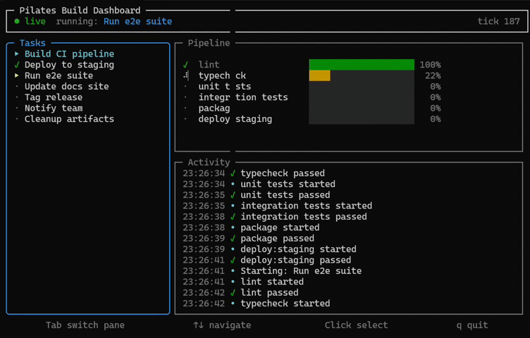

<p align="center">
  <picture>
    <source media="(prefers-color-scheme: dark)" srcset="./assets/logo-wordmark-dark.svg">
    
  </picture>
</p>

<p align="center">
  <a href="https://www.npmjs.com/package/@pilates/core"></a>
  <a href="https://www.npmjs.com/package/@pilates/render"></a>
  <a href="https://bundlephobia.com/package/@pilates/core"></a>
  <a href="./LICENSE"></a>
</p>

<!-- Demo: once recorded, drop assets/demo.gif into ./assets/ and uncomment.
     Suggested: `asciinema rec` while running
     `pnpm --filter @pilates-examples/progress-table dev`,
     then convert with `agg demo.cast assets/demo.gif`.
<p align="center">
  
</p>
-->

> Headless flex layout engine for terminal UIs. Pure TypeScript, zero runtime
> dependencies.

**Pilates** is a flex layout engine designed for the terminal: integer cell
coordinates, CJK / emoji / wide-char awareness, ANSI escape passthrough, and
unbundled from any UI framework. Use it directly to compute layouts, or wrap
the included renderer to produce styled strings.

```ts
import { render } from '@pilates/render';

process.stdout.write(
  render({
    width: 80,
    height: 6,
    flexDirection: 'row',
    children: [
      { flex: 1, border: 'rounded', title: 'Logs',   children: [{ text: 'user logged in' }] },
      { width: 20, border: 'single', title: 'Status', children: [{ text: 'ok', color: 'green', bold: true }] },
    ],
  }),
);
// ╭─ Logs ───────────────────────────────────────────────────╮┌─ Status ─────────┐
// │user logged in                                            ││ok                │
// │                                                          ││                  │
// │                                                          ││                  │
// ╰──────────────────────────────────────────────────────────╯└──────────────────┘
```

## Why

Terminal UIs in JavaScript are dominated by [Ink](https://github.com/vadimdemedes/ink),
which couples two distinct concerns into one package: a WASM flex layout
engine and a React reconciler. If you want the layout half, you have to take
all of React. **Pilates** separates them:

- **`@pilates/core`** — the engine. Imperative `Node` API, returns integer cell
  coordinates. Pure TypeScript, **zero runtime dependencies**. Handles
  CJK / emoji / wide-char widths, integer-cell rounding, the CSS Flexbox
  freeze loop, and absolute positioning. Validated cell-for-cell against a
  reference WASM flexbox implementation across 30 oracle fixtures.
- **`@pilates/render`** — the out-of-box renderer. Declarative POJO tree →
  painted ANSI string with borders, titles, colors, and text wrap. Uses core
  internally; depends only on it.

A future `@pilates/react` reconciler can sit alongside `@pilates/render`
without touching either.

## Packages

| Package | Status | What |
|---|---|---|
| [`@pilates/core`](./packages/core)     | `1.0.0-rc.1` | Engine: imperative Node API, returns layout boxes. |
| [`@pilates/render`](./packages/render) | `1.0.0-rc.2` | Out-of-box: declarative tree → painted string. |
| [`@pilates/diff`](./packages/diff)     | `0.1.0`      | Cell-level frame diff + minimal ANSI redraw. |

## Examples

Three runnable examples live under [`examples/`](./examples/):

| Example | What it shows |
|---|---|
| [chat-log](./examples/chat-log)             | Two-pane chat layout: scrolling messages + status sidebar. Wide-char & emoji passthrough. |
| [progress-table](./examples/progress-table) | Multi-row progress dashboard with bars and color-coded status. |
| [split-pane](./examples/split-pane)         | Editor-style: header + 3-pane body (files / editor / outline) + status footer. |

```bash
pnpm install
pnpm --filter @pilates-examples/chat-log dev
pnpm --filter @pilates-examples/progress-table dev
pnpm --filter @pilates-examples/split-pane dev
```

## Quick start (using just the engine)

```ts
import { Node, Edge } from '@pilates/core';

const root = Node.create();
root.setFlexDirection('row');
root.setWidth(80);
root.setHeight(24);
root.setPadding(Edge.All, 1);

const main = Node.create();
main.setFlex(1);
const sidebar = Node.create();
sidebar.setWidth(20);

root.insertChild(main, 0);
root.insertChild(sidebar, 1);
root.calculateLayout();

main.getComputedLayout();    // { left:1, top:1, width:57, height:22 }
sidebar.getComputedLayout(); // { left:58, top:1, width:20, height:22 }
```

You'd then paint to the terminal yourself — or pass the same shape via the
declarative API to `@pilates/render` to skip the painting:

```ts
import { render } from '@pilates/render';

process.stdout.write(
  render({
    width: 80,
    height: 24,
    flexDirection: 'row',
    padding: 1,
    children: [{ flex: 1 }, { width: 20 }],
  }),
);
```

## What's supported

| Category | Properties |
|---|---|
| Direction | `flexDirection` (row / column / -reverse), `flexWrap` (nowrap / wrap / wrap-reverse) |
| Sizing | `width`, `height`, `minWidth`, `minHeight`, `maxWidth`, `maxHeight` |
| Flex | `flex` (shorthand), `flexGrow`, `flexShrink`, `flexBasis` |
| Spacing | `padding` / `margin` per edge, `gap` (row + column) |
| Alignment | `justifyContent`, `alignItems`, `alignSelf`, `alignContent` (all CSS values) |
| Position | `positionType` (relative / absolute), `position` per edge |
| Visibility | `display` (flex / none) |
| Render-only | `border` (5 styles), `borderColor`, `title`, `color`, `bgColor`, `bold`, `italic`, `underline`, `dim`, `inverse`, `wrap` |

**Out of v1:** `aspectRatio`, RTL/LTR direction inheritance, baseline alignment,
input handling, animations, scroll containers, style inheritance.

## Validation

Every flex feature is verified cell-for-cell against a reference WASM
flexbox implementation:

- 30 oracle fixtures (fixed widths, flex distributions, padding, margin,
  gap, min/max, all `justifyContent` / `alignItems` / `alignSelf` /
  `alignContent` values, `flexWrap`, `flexWrap: wrap-reverse`, every absolute
  positioning anchor)
- 200+ unit + algorithm + render tests
- Unicode width fuzzer running through 200 randomized strings against
  `@xterm/headless` per CI run

## Notable design choices

- **Default `flexShrink: 0` in core** (React Native convention, not CSS's 1)
  — declared widths stay declared. The render layer flips this to 1 for text
  leaves so wrapped text fits its container.
- **Absolute offsets are relative to the parent's outer box, not its
  content (post-padding) box** — React Native semantics, not CSS. Keeps
  consumers porting from Ink / RN consistent.
- **Integer cell rounding rounds absolute corners and derives size from
  rounded edges** — sibling boxes butt cleanly across uneven splits
  (`[100, flex:1, flex:1, flex:1]` → `[34, 33, 33]`).

## Status

Release candidate. Core algorithm is feature-complete for v1; render layer
covers everything you'd want for static dashboards and CLI panels. Public
launch tracked on the v1 milestone.

## License

MIT
