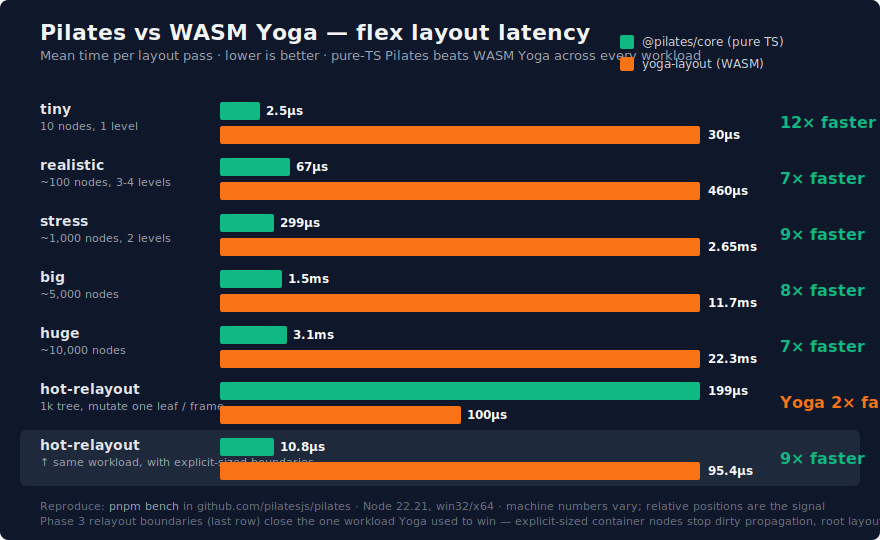

<p align="center">
  <picture>
    <source media="(prefers-color-scheme: dark)" srcset="./assets/logo-wordmark-dark.svg">
    
  </picture>
</p>

<p align="center">
  <a href="https://www.npmjs.com/package/@pilates/core"></a>
  <a href="https://www.npmjs.com/package/@pilates/render"></a>
  <a href="https://www.npmjs.com/package/@pilates/react"></a>
  <a href="https://www.npmjs.com/package/@pilates/widgets"></a>
  <a href="https://bundlephobia.com/package/@pilates/core"></a>
  <a href="./LICENSE"></a>
</p>

<p align="center">
  
</p>

> Headless flex layout engine for terminal UIs. Pure TypeScript, zero runtime
> dependencies.

**Pilates** is a flex layout engine designed for the terminal: integer cell
coordinates, CJK / emoji / wide-char awareness, ANSI escape passthrough, and
unbundled from any UI framework. Use it directly to compute layouts, or wrap
the included renderer to produce styled strings.

```ts
import { render } from '@pilates/render';

process.stdout.write(
  render({
    width: 80,
    height: 6,
    flexDirection: 'row',
    children: [
      { flex: 1, border: 'rounded', title: 'Logs',   children: [{ text: 'user logged in' }] },
      { width: 20, border: 'single', title: 'Status', children: [{ text: 'ok', color: 'green', bold: true }] },
    ],
  }),
);
// ╭─ Logs ───────────────────────────────────────────────────╮┌─ Status ─────────┐
// │user logged in                                            ││ok                │
// │                                                          ││                  │
// │                                                          ││                  │
// ╰──────────────────────────────────────────────────────────╯└──────────────────┘
```

## Why

Terminal UIs in JavaScript are dominated by [Ink](https://github.com/vadimdemedes/ink),
which couples two distinct concerns into one package: a WASM flex layout
engine and a React reconciler. If you want the layout half, you have to take
all of React. **Pilates** separates them:

- **`@pilates/core`** — the engine. Imperative `Node` API, returns integer cell
  coordinates. Pure TypeScript, **zero runtime dependencies**. Handles
  CJK / emoji / wide-char widths, integer-cell rounding, the CSS Flexbox
  freeze loop, and absolute positioning. Validated cell-for-cell against a
  reference WASM flexbox implementation across 33 oracle fixtures.
- **`@pilates/render`** — the out-of-box renderer. Declarative POJO tree →
  painted ANSI string with borders, titles, colors, and text wrap. Uses core
  internally; depends only on it.
- **`@pilates/diff`** — cell-level frame diffing + minimal ANSI redraw
  sequences for live TUIs. Pairs with `@pilates/render`.
- **`@pilates/react`** — optional React reconciler on top of the same engine,
  for consumers who want JSX and hooks. Independent of the core / render /
  diff stack — you don't pay for it if you don't import it.
- **`@pilates/widgets`** — interactive widgets (`TextInput`, `Select`,
  `Spinner`) built on `@pilates/react`. For wizard-style CLI flows.

## Packages

| Package | Status | What |
|---|---|---|
| [`@pilates/core`](./packages/core)       | `1.0.1`          | Engine: imperative Node API, returns layout boxes. |
| [`@pilates/render`](./packages/render)   | `1.0.1`          | Out-of-box: declarative tree → painted string. |
| [`@pilates/diff`](./packages/diff)       | `0.2.0`          | Cell-level frame diff + minimal ANSI redraw. |
| [`@pilates/react`](./packages/react)     | `0.3.0`          | React reconciler — author terminal UIs with JSX, hooks, mouse, focus, scroll. |
| [`@pilates/widgets`](./packages/widgets) | `0.1.0-rc.3`     | Interactive widgets (`TextInput`, `Select`, `Spinner`, `MultiSelect`, `Tabs`, `Table`, `ProgressBar`, `TextArea`) for `@pilates/react`. |

## Examples

Eleven runnable examples live under [`examples/`](./examples/) — six built
on the imperative `@pilates/render` API, five built on `@pilates/react`.

**Imperative (`@pilates/render`):**

| Example | What it shows |
|---|---|
| [chat-log](./examples/chat-log)             | Two-pane chat layout: scrolling messages + status sidebar. Wide-char & emoji passthrough. |
| [dashboard](./examples/dashboard)           | System-monitor layout: status header, four stat tiles in a row, metrics strip. |
| [gallery](./examples/gallery)               | Grid of cards that wraps to multiple rows on a narrow container. |
| [modal](./examples/modal)                   | Confirm-action modal floating over a list — exercises absolute positioning. |
| [progress-table](./examples/progress-table) | Multi-row progress dashboard with bars and color-coded status. |
| [split-pane](./examples/split-pane)         | Editor-style: header + 3-pane body (files / editor / outline) + status footer. |

**React (`@pilates/react` + `@pilates/widgets`):**

| Example | What it shows |
|---|---|
| **[react-build-dashboard](./examples/react-build-dashboard)** | **Flagship demo.** Interactive build-pipeline dashboard: `<ScrollView>` × 2, mouse, `useFocus`, keyboard nav, animation, `<ProgressBar>` + `<Spinner>` widgets, all stitched together. |
| [react-counter](./examples/react-counter)     | Minimal reconciler example: counter incrementing every 250ms, demonstrating the diff-based redraw loop. |
| [react-dashboard](./examples/react-dashboard) | React port of `dashboard` with a live `tick` counter on the header. |
| [react-modal](./examples/react-modal)         | React port of `modal`: centered confirmation dialog over a scrollable list. |
| [react-wizard](./examples/react-wizard)       | Multi-step `TextInput → Select → Spinner` wizard exercising every `@pilates/widgets` component. |

```bash
pnpm install
# imperative
pnpm --filter @pilates-examples/chat-log dev
pnpm --filter @pilates-examples/progress-table dev
# react
pnpm --filter @pilates-examples/react-counter dev
pnpm --filter @pilates-examples/react-wizard dev
# flagship
pnpm --filter @pilates-examples/react-build-dashboard dev
```

## Quick start (using just the engine)

```ts
import { Node, Edge } from '@pilates/core';

const root = Node.create();
root.setFlexDirection('row');
root.setWidth(80);
root.setHeight(24);
root.setPadding(Edge.All, 1);

const main = Node.create();
main.setFlex(1);
const sidebar = Node.create();
sidebar.setWidth(20);

root.insertChild(main, 0);
root.insertChild(sidebar, 1);
root.calculateLayout();

main.getComputedLayout();    // { left:1, top:1, width:58, height:22 }
sidebar.getComputedLayout(); // { left:59, top:1, width:20, height:22 }
```

You'd then paint to the terminal yourself — or pass the same shape via the
declarative API to `@pilates/render` to skip the painting:

```ts
import { render } from '@pilates/render';

process.stdout.write(
  render({
    width: 80,
    height: 24,
    flexDirection: 'row',
    padding: 1,
    children: [{ flex: 1 }, { width: 20 }],
  }),
);
```

## What's supported

| Category | Properties |
|---|---|
| Direction | `flexDirection` (row / column / -reverse), `flexWrap` (nowrap / wrap / wrap-reverse) |
| Sizing | `width`, `height`, `minWidth`, `minHeight`, `maxWidth`, `maxHeight` |
| Flex | `flex` (shorthand), `flexGrow`, `flexShrink`, `flexBasis` |
| Spacing | `padding` / `margin` per edge, `gap` (row + column) |
| Alignment | `justifyContent`, `alignItems`, `alignSelf`, `alignContent` (all CSS values) |
| Position | `positionType` (relative / absolute), `position` per edge |
| Visibility | `display` (flex / none) |
| Render-only | `border` (5 styles), `borderColor`, `title`, `color`, `bgColor`, `bold`, `italic`, `underline`, `dim`, `inverse`, `wrap` |

**Out of v1:** `aspectRatio`, RTL/LTR direction inheritance, baseline alignment,
input handling, animations, scroll containers, style inheritance.

## Performance

<p align="center">
  
</p>

Pure-TypeScript layout, validated cell-for-cell against WASM Yoga,
faster than WASM Yoga on every benchmarked workload. Numbers are mean
latency from `pnpm bench` (Node 26, darwin/arm64; relative positions
are the interesting signal):

| Scenario | Pilates core | yoga-layout (WASM) | Pilates speedup |
|---|---:|---:|---:|
| tiny (10 nodes) | 1.5µs | 15.1µs | **10× faster** |
| realistic (~100) | 29µs | 263µs | **9× faster** |
| stress (~1000) | 171µs | 1.52ms | **9× faster** |
| big (~5000) | 0.94ms | 7.26ms | **8× faster** |
| huge (~10000) | 2.16ms | 14.6ms | **7× faster** |
| hot-relayout (1k persistent, mutate one leaf/frame) | 129µs | 56µs | Yoga wins ~2× |
| **hot-relayout + boundaries** (same + explicit-sized rows) | **7.1µs** | **51µs** | **7× faster** |

The hot-relayout scenario was the only workload Yoga had been winning
on — long-lived trees with hot per-frame mutations. With Phase 3's
relayout boundaries, any container with `width: N, height: M` (the
idiomatic TUI pattern) acts as a barrier that stops dirty propagation,
so descendant mutations don't invalidate ancestor caches. Pilates is
now strictly faster than WASM Yoga across every benchmarked workload
when consumers structure trees with explicit-sized containers.

WASM Yoga's compute kernel is genuinely faster than pure-TS Pilates,
but every `setProperty` / `Node.create` crosses the JS↔WASM boundary
and that marshalling cost dominates at TUI tree sizes (10–10k nodes).

Reproduce with `pnpm bench`. Full numbers + scenario shapes in
[`bench/RESULTS.md`](./bench/RESULTS.md).

## Validation

Every flex feature is verified cell-for-cell against a reference WASM
flexbox implementation:

- 33 oracle fixtures (fixed widths, flex distributions, padding, margin,
  gap, min/max, all `justifyContent` / `alignItems` / `alignSelf` /
  `alignContent` values, `flexWrap`, `flexWrap: wrap-reverse`, every absolute
  positioning anchor)
- 200+ unit + algorithm + render tests
- Unicode width fuzzer running through 200 randomized strings against
  `@xterm/headless` per CI run, plus a fixture set of pinned agreement
  cases and documented divergences (where modern terminals render wider
  than xterm.js's Unicode-11 tables)
- Property-based fuzz with `fast-check` over layout invariants —
  non-overflow, sibling non-overlap, reproducibility — across randomly
  generated trees

## Notable design choices

- **Default `flexShrink: 0` in core** (React Native convention, not CSS's 1)
  — declared widths stay declared. The render layer flips this to 1 for text
  leaves so wrapped text fits its container.
- **Absolute offsets are relative to the parent's outer box, not its
  content (post-padding) box** — React Native semantics, not CSS. Keeps
  consumers porting from Ink / RN consistent.
- **Integer cell rounding rounds absolute corners and derives size from
  rounded edges** — sibling boxes butt cleanly across uneven splits
  (`[100, flex:1, flex:1, flex:1]` → `[34, 33, 33]`).

## Status

`@pilates/core@1.0.0` and `@pilates/render@1.0.0` are released.
Core algorithm + flex pipeline are feature-complete, validated
cell-for-cell against WASM Yoga, and faster than Yoga on every
benchmarked workload (see Performance above). The React layer ships
mouse, scroll, focus management, and typed errors.

## Contributing

Issues, discussions, and PRs welcome. Start with
[CONTRIBUTING.md](./CONTRIBUTING.md) for setup, the test loop, and what
the maintainer expects from layout-algorithm changes (oracle-fixture
coverage). By participating you agree to follow the
[Code of Conduct](./CODE_OF_CONDUCT.md). Security issues: see
[SECURITY.md](./SECURITY.md) for the private disclosure channel.

## License

[MIT](./LICENSE) © Zhijie Wang.
